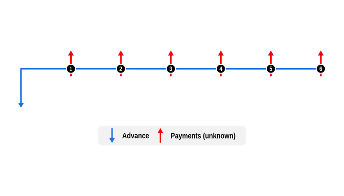

# Example 1: Determine a payment in an arrears repayment profile

This example illustrates the use of one of two [Modes](/api/curo/Mode.html), a core concept in financial calculations, when solving for unknowns. 

## Overview

This example demonstrates how to calculate the value of a payment when it's due at the end of each repayment period, known as 'in arrears'. To switch to payments due at the beginning of each period ('in advance'), simply set `mode: Mode.advance` in the `SeriesPayment`.

## Code

This example solves for an unknown instalment amount for a $10,000 loan over six months, the default [Frequency](/api/curo/Frequency.html) if not defined.

After the unknown values are solved we confirm the implicit interest rate (IRR) in the resulting profile equals the provided interest rate.

Notes:

- Dates are optional and default to the current system date. Here, a fixed `startDate` is provided solely to ensure reproducible test results.

```dart
import 'package:curo/curo.dart';

void main() async {

  // Create a calculator instance and define cash flow series
  final calculator = Calculator(precision: 2)
    ..add(SeriesAdvance(
        label: 'Loan',
        amount: 10000.0,
    ))
    ..add(SeriesPayment(
        numberOf: 6,
        label: 'Instalment',
        amount: null, // Set to null for unknown value
        mode: Mode.arrear,
    ));

  // Solve for the unknown and validate rate
  final convention = const US30U360();

  final payment = await calculator.solveValue(
    convention: convention,
    interestRate: 0.0825,
    startDate: DateTime.utc(2026, 1, 5),
  );

  final irr = await calculator.solveRate(convention: convention);

  // Optionally create an amortisation schedule and display results
  final schedule =
    calculator.buildSchedule(convention: convention, interestRate: irr);

  print('Monthly instalment: \$${payment.toStringAsFixed(2)}');
  print('Implicit interest rate: ${(irr * 100).toStringAsFixed(2)}%');
  schedule.prettyPrint(convention: convention);
}
```
Console output:

```
Monthly instalment: $1707.00
Implicit interest rate: 8.25%

post_date    label                            amount        capital       interest  capital_balance
---------------------------------------------------------------------------------------------------
2026-01-05   Loan                         -10,000.00     -10,000.00           0.00       -10,000.00
2026-02-05   Instalment                     1,707.00       1,638.25         -68.75        -8,361.75
2026-03-05   Instalment                     1,707.00       1,649.51         -57.49        -6,712.24
2026-04-05   Instalment                     1,707.00       1,660.85         -46.15        -5,051.39
2026-05-05   Instalment                     1,707.00       1,672.27         -34.73        -3,379.12
2026-06-05   Instalment                     1,707.00       1,683.77         -23.23        -1,695.35
2026-07-05   Instalment                     1,707.00       1,695.35         -11.65             0.00
```

## Cash Flow Diagram

The diagram below visualizes the cash flow dynamics of a $10,000 loan with six instalment payments, as implemented in the example code.

- Advance: This is shown by a blue downward arrow at the start of the timeline, indicating the value is known.

- Payments: Represented by red upward arrows signifying they are unknown, these are the regular monthly payments. Notice how the first payment in the series occurs at the end of the first month after the Advance, and the remaining payments regularly thereafter.


