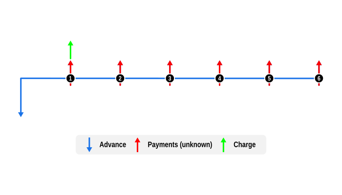

# Example 2: Determine the APR implicit in a repayment schedule, including charges

This example illustrates the use of the one of three supported legally defined APR Day Count Conventions

## Overview

This example demonstrates how to calculate the Annual Percentage Rate (APR) for a consumer loan, in accordance with the [EU 2008/48 APR](/api/curo/EU200848EC-class.html). The same approach works for any supported APR convention (e.g., [US Appendix J APR](/api/curo/USAppendixJ-class.html) or [UK Conc App APR](/api/curo/UKConcApp-class.html)).

## Code

This example solves for an unknown APR for a €10,000 loan over six months, including a €50 fee due with the first instalment.

First the unknown instalment payment is solved using `US30U360`, a [standard convention](/api/curo/US30U360-class.html), and then we show how to confirm the APR thereafter. If all values are known beforehand, skip the `solveValue` step and go straight to solving the implicit APR.

Notes:

- Use date input to correctly align end of contract fees or charges.

- Dates are optional and default to the current system date. Here, a fixed `startDate` is provided solely to ensure reproducible test results.

```dart
import 'package:curo/curo.dart';

void main() async {
  
  // Create a calculator instance and define cash flow series
  final calculator = Calculator()
    ..add(SeriesAdvance(
      label: 'Loan',
      amount: 10000.0,
    ))
    ..add(SeriesPayment(
      numberOf: 6,
      label: 'Instalment',
      amount: null,
      mode: Mode.arrear,
    ))
    ..add(SeriesCharge(
      label: 'Fee',
      amount: 50.0,
      mode: Mode.arrear,
    ));

  // Solve for the unknown and validate rate
  final payment = await calculator.solveValue(
    convention: US30U360(),
    interestRate: 0.0825,
    startDate: DateTime.utc(2026, 1, 5),
  );

  final convention = EU200848EC();

  final apr = await calculator.solveRate(convention: convention);

  // Optionally create a, APR proof schedule and display results
  final schedule = calculator.buildSchedule(
    convention: convention,
    interestRate: apr,
  );

  print('Monthly instalment: €${payment.toStringAsFixed(2)}');
  print('Annual percentage rate: ${(apr * 100).toStringAsFixed(2)}%\n');
  schedule.prettyPrint(convention: convention);
```
Console output:

```
Monthly instalment: €1707.00
Annual percentage rate: 10.45%

post_date    label               amount discount_log                  amount_disc     disc_balance
--------------------------------------------------------------------------------------------------
2026-01-05   Loan            -10,000.00 f = 0 = 0.00000000             -10,000.00       -10,000.00
2026-02-05   Instalment        1,707.00 f = 1/12 = 0.08333333            1,692.92        -8,307.08
2026-02-05   Fee                  50.00 f = 1/12 = 0.08333333               49.59        -8,257.49
2026-03-05   Instalment        1,707.00 f = 2/12 = 0.16666667            1,678.96        -6,578.53
2026-04-05   Instalment        1,707.00 f = 3/12 = 0.25000000            1,665.12        -4,913.41
2026-05-05   Instalment        1,707.00 f = 4/12 = 0.33333333            1,651.38        -3,262.03
2026-06-05   Instalment        1,707.00 f = 5/12 = 0.41666667            1,637.77        -1,624.26
2026-07-05   Instalment        1,707.00 f = 6/12 = 0.50000000            1,624.26             0.00
```

## Cash Flow Diagram

The diagram below visualizes the cash flow dynamics of a €10,000 loan with six instalment payments, including a €50 fee, as implemented in the example code.

- Advance: Depicted by a blue downward arrow at the start of the timeline, this represents the full cash price or loan value, known from the outset.

- Payments: The red upward arrows, signifying they are unknown, are the regular payments made in arrears, meaning at the end of each payment period.

- Charges: Represented by a green upward arrow (e.g., origination or setup fees).

