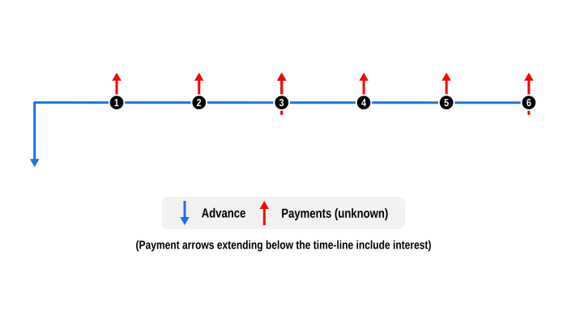

# Example 3: Determine a payment using a different interest frequency

This example demonstrates how to calculate a payment when interest is compounded at one frequency, separate from the payment schedule.

## Overview

This example illustrates how to determine the payment value in a repayment schedule with a separate compounding frequency, in this case monthly repayments with quarterly compounding interest. This setup is common in consumer loans. 

Important: Ensure the payment and interest capitalisation schedules end on the same date to avoid inconsistencies.

## Code

This example solves for an unknown instalment amount for a $10,000 loan over six months, the default [Frequency](https://andrewmurphy353.github.io/curo/api/curo/Frequency.html) if not defined, with quarterly compound interest.

We demonstrate that this type of calculation requires at least two `SeriesPayment` series:

- A regular payment series, where you assign `isInterestCapitalised: false`, to specifiy no interest capitalisation

- A corresponding interest capitalisation series, where you assign `isInterestCapitalised: true`, and `amount: 0.0` to avoid unexpected results.

After the unknown values are solved we confirm the implicit interest rate (IRR) in the resulting profile equals the provided interest rate.

Notes:

- Date input is mandatory for these calculations to ensure the cash-flows of the regular payment series and interest capitalisation series align and share a common end-date.

```dart
import 'package:curo/curo.dart';

void main() async {

  // Create a calculator instance and define cash flow series
  final calculator = Calculator()
    ..add(SeriesAdvance(
      numberOf: 1,
      label: 'Loan',
      amount: 10000.0,
    ))
    ..add(SeriesPayment(
      numberOf: 6,
      label: 'Instalment',
      amount: null,
      frequency: Frequency.monthly,
      postDateFrom: DateTime.utc(2026, 2, 5),
      isInterestCapitalised: false,
    ))
    ..add(SeriesPayment(
      numberOf: 2,
      label: 'Interest',
      amount: 0.0, // Zero payment value (interest only)
      frequency: Frequency.quarterly,
      postDateFrom: DateTime.utc(2026, 4, 5),
      isInterestCapitalised: true, // Add interest
    ));

  // Solve for the unknown and validate rate
  final convention = const US30U360();

  final payment = await calculator.solveValue(
    convention: convention,
    interestRate: 0.0825,
    startDate: DateTime.utc(2026, 1, 5),
  );

  final irr = await calculator.solveRate(convention: convention);

  // Optionally create an amortisation schedule and display results
  final schedule = calculator.buildSchedule(
    convention: convention,
    interestRate: irr,
  );

  print('Monthly instalment: \$${payment.toStringAsFixed(2)}');
  print('Implicit interest rate: ${(irr * 100).toStringAsFixed(2)}%\n');
  schedule.prettyPrint(convention: convention);
```
Console output:

```
Monthly instalment: $1706.67
Implicit interest rate: 8.25%

post_date    label                            amount        capital       interest  capital_balance
---------------------------------------------------------------------------------------------------
2026-01-05   Loan                         -10,000.00     -10,000.00           0.00       -10,000.00
2026-02-05   Instalment                     1,706.67       1,706.67           0.00        -8,293.33
2026-03-05   Instalment                     1,706.67       1,706.67           0.00        -6,586.66
2026-04-05   Instalment                     1,706.67       1,706.67           0.00        -4,879.99
2026-04-05   Interest                           0.00        -171.04        -171.04        -5,051.03
2026-05-05   Instalment                     1,706.67       1,706.67           0.00        -3,344.36
2026-06-05   Instalment                     1,706.67       1,706.67           0.00        -1,637.69
2026-07-05   Instalment                     1,706.67       1,706.67           0.00            68.98
2026-07-05   Interest                           0.00         -68.98         -68.98             0.00
```

## Cash Flow Diagram

The diagram below visualizes the cash flow dynamics of a $10,000 loan with six monthly instalments and quarterly compounded interest, as implemented in the example code.

- Advance: This is shown by a blue downward arrow at the start of the timeline, indicating the value is known.

- Payments: The regular unknown payments are represented by red upward arrows. The short downward extension on every third payment arrow indicates that capitalised interest is added at those points.

Note: The quarterly interest capitalisation payments cannot be displayed as they have a zero value. However, there is one cash flow diagram notation used in these examples which has not been discussed yet, and that is the payment up arrows also extend for a short distance below the timeline. We use this to signify the payment includes capitalised interest. Note therefore in this example that the line only extends every third payment, when the repayment and interest schedules align. 

