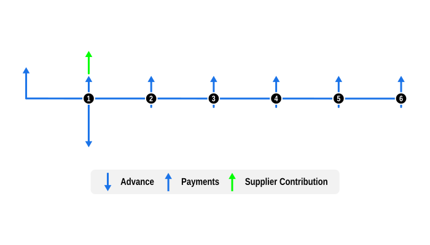

# Example 4: Determine a supplier 0% finance scheme contribution, combined with a deferred settlement

This example demonstrates how to calculate an equipment supplier's contribution to the borrower's finance costs in 0% finance offers, and incorporates a settlement deferral by the third-party finance company.

## Overview

This example illustrates the combination of two financial concepts:

- **0% finance**: These products can be characterised as containing disclosed and non-disclosed cash flows.
    - The disclosed cash flows, which a borrower is aware of, are the full retail cost (advance) of the financed item and the payment cash flows which contain principal only; the sum of payment cash flows equals the item cost (advance), resulting in an effective 0% interest rate for the borrower.
    - The non-disclosed cash flows are the direct transactions between supplier and lender, usually a cash discount to offset the financing costs of the lender.

- **Deferred settlements**: This is where an equipment supplier with close ties to a finance company, allow them to defer payment for the equipment purchase to facilitate the pass on of benefits like reduced payments or interest to borrowers.

## Code

This example solves for an unknown supplier contribution to cover the finance cost of a $10,000 car purchase with six monthly capital payments. The calculation is from the lender viewpoint, and includes a one month supplier settlement deferral, so the calculation is performed using **values dates** defined by the each Series `valueDateFrom` date.

Notes:

- `SeriesAdvance`: The `postDateFrom` date is the documented date of the contract, and `valueDateFrom` is the date of supplier settlement (undisclosed to borrower)

- `SeriesPayment`'s:
    - The borrower's documented payments are the deposit of $4000.00 and 6 x $1000.00 monthly payments, the sum equaling the advance amount (hence 0% finance).
    - The supplier's undisclosed contribution to cover the finance company's return on capital is the unknown to solve.

Deferred settlements require calculations to be undertaken using **value dates**, so we pass `usePostDates: false` to the chosen Day Count Conventions, e.g. `US30U360(usePostDates: false)`. This ensures the calculation is performed from the lender's perspective.

After determining the supplier contribution we show how to verify the lender's implicit return (IRR), again using `usePostDates: false`, and display the result schedule from the lender's perspective i.e. in value-date order.

```dart
import 'package:curo/curo.dart';

void main() async {

  // Create a calculator instance and define cash flow series
  final calculator = Calculator()
    ..add(SeriesAdvance(
      label: 'Cost of car',
      amount: 10000.0,
      postDateFrom: DateTime.utc(2026, 1, 5),
      valueDateFrom: DateTime.utc(2026, 2, 5),
    ))
    ..add(SeriesPayment(
      label: 'Deposit',
      amount: 4000.0,
      postDateFrom: DateTime.utc(2026, 1, 5),
    ))
    ..add(SeriesPayment(
      label: 'Supplier contribution',
      amount: null,
      postDateFrom: DateTime.utc(2026, 2, 5),
    ))
    ..add(SeriesPayment(
      numberOf: 6,
      label: 'Instalment',
      amount: 1000.0,
      postDateFrom: DateTime.utc(2026, 2, 5),
    ));

  // Solve for the unknown and validate rate
  final convention = const US30U360(usePostDates: false); // by value date

  final supplierContribution = await calculator.solveValue(
    convention: convention,
    interestRate: 0.050, // lender return on capital
    startDate: DateTime.utc(2026, 1, 5),
  );

  final lenderIrr = await calculator.solveRate(convention: convention);

  // Optionally create an amortisation schedule and display results
  final schedule = calculator.buildSchedule(
    convention: convention,
    interestRate: lenderIrr,
  );

  print('Supplier contribution: \$${supplierContribution.toStringAsFixed(2)}');
  print('Lender\'s IRR: ${(lenderIrr * 100).toStringAsFixed(2)}%\n');
  schedule.prettyPrint(convention: convention);
```
Console output:

```
Supplier contribution: $61.90
Lender's IRR: 5.00%

value_date   label                          amount        capital       interest  capital_balance
-------------------------------------------------------------------------------------------------
2026-01-05   Deposit                      4,000.00       4,000.00           0.00         4,000.00
2026-02-05   Cost of car                -10,000.00     -10,000.00           0.00        -6,000.00
2026-02-05   Instalment                   1,000.00       1,000.00           0.00        -5,000.00
2026-02-05   Supplier contribution           61.90          61.90           0.00        -4,938.10
2026-03-05   Instalment                   1,000.00         979.42         -20.58        -3,958.68
2026-04-05   Instalment                   1,000.00         983.50         -16.50        -2,975.18
2026-05-05   Instalment                   1,000.00         987.60         -12.40        -1,987.58
2026-06-05   Instalment                   1,000.00         991.72          -8.28          -995.86
2026-07-05   Instalment                   1,000.00         995.86          -4.14             0.00
```

## Cash Flow Diagram

The diagram below visualizes the cash flow dynamics of a borrower's $10,000 interest-free loan with a deposit and six monthly instalments, showing the deferred supplier settlement and contribution to offset finance charges, as implemented in the example code.

- Advance: The full retail cost of the financed goods is shown as a blue downward arrow. Note that the blue advance arrow is positioned at the supplier settlement date (end of month 1) rather than the contract start, reflecting the lender's perspective.

- Payments:
    - The known borrower deposit is represented by the longer blue upward arrow at the start of the time-line.
    - The known borrower payments are represented by blue upward arrows.
    - The supplier discount required to offset the financing costs is shown by a green upward arrow above the borrower’s first payment at the end of month 1.

