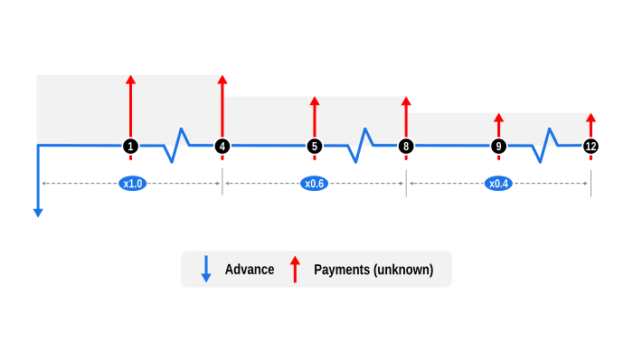

# Example 5: Determine a payment using a stepped weighted profile

This example illustrates solving unknown payments on a proportional basis to accelerate capital repayment using a stepped profile.

## Overview

This example demonstrates how to calculate a payment schedule where early and mid-term payments focus on reducing the principal faster. This method is often adopted in small business loans to align with asset depreciation rates, and leverages the `SeriesPayment` payment weighting feature. This feature allows for proportional distribution of an unknown payment across multiple series, rather than solving for a single value.

## Code

This example solves for an unknown instalment amount for a $10,000 loan over twelve months, with the first 4 instalments 100% weighted, the next 4 by 60%, and the last 4 by 40%.

This is implemented by creating three separate `SeriesPayment` instances for each weighted instalment grouping and assigning the following values to the `weighting` attribute, as follows:

- Instalments 1 - 4: `weighting: 1.0   // 100% of unknown`

- Instalments 5 - 8: `weighting: 0.6   // 60% of unknown`

- Instalments 9 - 12: `weighting: 0.4   // 40% of unknown`

After the unknown values are solved we confirm the implicit interest rate (IRR) in the resulting profile equals the provided interest rate.

Notes:

- Weighting calculations require two or more `SeriesPayment` rows. Applying a weight to a single payment series does not alter the result; the entire unknown value is assigned to that series.

- The solved for unknown is the **fully weighted** value, i.e. 100%. The provided schedule lists the weighted cash flows.

- Dates are optional and default to the current system date. Here, a fixed `startDate` is provided solely to ensure reproducible test results.

```dart
import 'package:curo/curo.dart';

void main() async {

  // Create a calculator instance and define cash flow series
  final calculator = Calculator(precision: 2)
    ..add(SeriesAdvance(
      label: 'Loan',
      amount: 10000.0,
    ))
    ..add(SeriesPayment(
      numberOf: 4,
      label: 'Instalment',
      amount: null,
      mode: Mode.arrear,
      weighting: 1.0, // 100% of unknown
    ))
    ..add(SeriesPayment(
      numberOf: 4,
      label: 'Instalment',
      amount: null,
      mode: Mode.arrear,
      weighting: 0.6, // 60% of unknown
    ))
    ..add(SeriesPayment(
      numberOf: 4,
      label: 'Instalment',
      amount: null,
      mode: Mode.arrear,
      weighting: 0.4, // 40% of unknown
    ));

  // Solve for the unknown and validate rate
  final convention = const US30U360();

  final paymentNormalWeight = await calculator.solveValue(
    convention: convention,
    interestRate: 0.070,
    startDate: DateTime.utc(2026, 1, 5),
  );

  final lenderIrr = await calculator.solveRate(convention: convention);

  // Optionally create an amortisation schedule and display results
  final schedule = calculator.buildSchedule(
    convention: convention,
    interestRate: lenderIrr,
  );

  print('Payment (normal weight): \$${paymentNormalWeight.toStringAsFixed(2)}');
  print('Lender IRR: ${(lenderIrr * 100).toStringAsFixed(2)}%\n');
  schedule.prettyPrint(convention: convention);
```
Console output:

```
Payment (normal weight): $1288.89
Lender IRR: 7.00%

post_date    label                            amount        capital       interest  capital_balance
---------------------------------------------------------------------------------------------------
2026-01-05   Loan                         -10,000.00     -10,000.00           0.00       -10,000.00
2026-02-05   Instalment                     1,288.89       1,230.56         -58.33        -8,769.44
2026-03-05   Instalment                     1,288.89       1,237.74         -51.15        -7,531.70
2026-04-05   Instalment                     1,288.89       1,244.96         -43.93        -6,286.74
2026-05-05   Instalment                     1,288.89       1,252.22         -36.67        -5,034.52
2026-06-05   Instalment                       773.33         743.97         -29.36        -4,290.55
2026-07-05   Instalment                       773.33         748.30         -25.03        -3,542.25
2026-08-05   Instalment                       773.33         752.67         -20.66        -2,789.58
2026-09-05   Instalment                       773.33         757.06         -16.27        -2,032.52
2026-10-05   Instalment                       515.56         503.70         -11.86        -1,528.82
2026-11-05   Instalment                       515.56         506.64          -8.92        -1,022.18
2026-12-05   Instalment                       515.56         509.60          -5.96          -512.58
2027-01-05   Instalment                       515.56         512.58          -2.98             0.00
```

## Cash Flow Diagram

The diagram below visualizes the cash flow dynamics of a $10,000 loan over 12 months, with the first 4 payments 100% weighted, the next 4 by 60%, and the last 4 by 40%, as implemented in the example code.

- Advance: This is shown by a blue downward arrow at the start of the timeline, indicating the value is known.

- Payments: The regular unknown payments are represented by red upward arrows. As the example uses three 4 monthly payment series with assigned weightings of 1.00, 0.60, and 0.40 respectively, we’ve adjusted the height of the upward arrows to reflect the reduction in payment values over time, and have also used a light grey background to emphasise the stepped profile.

Note: To keep the diagram readable, repeated identical payments are condensed, with a concertina (zig-zag) line indicating omitted periods.

