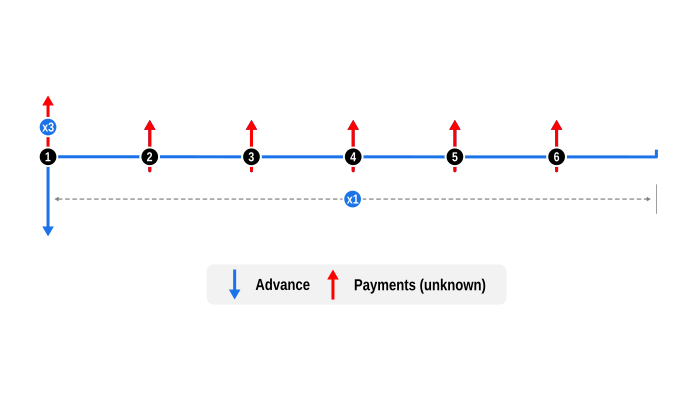

# Example 6: Determine a payment in a weighted 3+n repayment profile

This example illustrates the use of ‘front loading’ a repayment profile on a proportional basis when solving for unknowns.

## Overview

This example, a variation on example 5, demonstrates how to calculate a payment schedule where the first three payments are due at the contract's start, known as 'in advance'. The remaining payments are then spread out. This structure is commonly utilised in small business loans, particularly for leasing arrangements, and variations on this exist, such as 3+33, 3+35, etc. The example leverages the `SeriesPayment` payment weighting feature, which allows for proportional distribution of an unknown payment across multiple series, rather than solving for a single value.

## Code

This example solves for an unknown instalment amount for an $10,000 advance over six months, with the first rental triple weighted, and the remaining fully weighted.

This is implemented by creating two separate `SeriesPayment` instances for each weighted instalment grouping and assigning the following values to the `weighting` attribute, as follows:

- Rental 1: `weighting: 3.0  // 3x unknown`

- Rentals 2 - 6: `weighting: 1.0  // Fully weighted` (this is the default value so is left undefined)

After the unknown values are solved we confirm the implicit interest rate (IRR) in the resulting profile equals the provided interest rate.

Notes:

- Weighting calculations require two or more `SeriesPayment` rows. Applying a weight to a single payment series does not alter the result; the entire unknown value is assigned to that series.

- Dates are optional and default to the current system date. Here, a fixed `startDate` is provided solely to ensure reproducible test results.

```dart
import 'package:curo/curo.dart';

void main() async {

  // Create a calculator instance and define cash flow series
  final calculator = Calculator(precision: 2)
    ..add(SeriesAdvance(
      label: 'Equipment purchase',
      amount: 10000.0,
    ))
    ..add(SeriesPayment(
      numberOf: 1,
      label: 'Rental',
      amount: null,
      weighting: 3.0, // 3x unknown
    ))
    ..add(SeriesPayment(
      numberOf: 5,
      label: 'Rental',
      amount: null,
    ));

  // Solve for the unknown and validate rate
  final convention = const US30U360();

  final paymentNormalWeight = await calculator.solveValue(
    convention: convention,
    interestRate: 0.070,
    startDate: DateTime.utc(2026, 1, 5),
  );

  final lenderIrr = await calculator.solveRate(convention: convention);

  // Optionally create an amortisation schedule and display results
  final schedule = calculator.buildSchedule(
    convention: convention,
    interestRate: lenderIrr,
  );

  print('Payment (normal weight): \$${paymentNormalWeight.toStringAsFixed(2)}');
  print('Lender IRR: ${(lenderIrr * 100).toStringAsFixed(2)}%\n');
  schedule.prettyPrint(convention: convention);
}
```
Console output:

```
Payment (normal weight): $1263.64
Lender IRR: 7.00%

post_date    label                            amount        capital       interest  capital_balance
---------------------------------------------------------------------------------------------------
2026-01-05   Equipment purchase           -10,000.00     -10,000.00           0.00       -10,000.00
2026-01-05   Rental                         3,790.92       3,790.92           0.00        -6,209.08
2026-02-05   Rental                         1,263.64       1,227.41         -36.23        -4,981.67
2026-03-05   Rental                         1,263.64       1,234.57         -29.07        -3,747.10
2026-04-05   Rental                         1,263.64       1,241.77         -21.87        -2,505.33
2026-05-05   Rental                         1,263.64       1,249.02         -14.62        -1,256.31
2026-06-05   Rental                         1,263.64       1,256.31          -7.33             0.00
```

## Cash Flow Diagram

The diagram below visualizes the cash flow dynamics of a $10,000 loan over 6 months, with the first triple weighted, followed by 5 normally weighted, as implemented in the example code.

- Advance: This is shown by a blue downward arrow at the start of the timeline, indicating the value is known.

- Payments: Represented by red upward arrows, these are the regular unknown payments. Notice though how the first payment in the series coincides with the Advance and is annotated with the x3 annotation. This is the weighted payment, followed by the remaining payments regularly spaced. The timeline continues for a further month after the final payment, suggesting the contract ends at the end of the final payment period. Note however the contract end date may vary between lenders and may also depend on the number of payments taken in advance.

